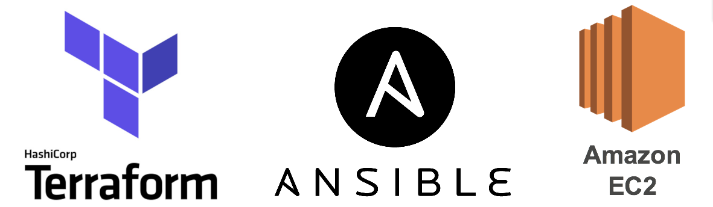

# IaC implementation - Creating, configuring and testing an AWS EC2 Instance
Terraform | Ansible | AWS | Shell script | Python

## How it works
To run the created pipeline to build, configure and test the infrastructure, the only thing needed is to execute the bash file *pipeline.sh*. This file executes other files (shell and python scripts) to make the infra with Terraform, configure the machine with ansible and test the created environment.

*Before run the pipeline, it's necessary to initialize the terraform backend with 'terraform init' inside terraform folder.*

